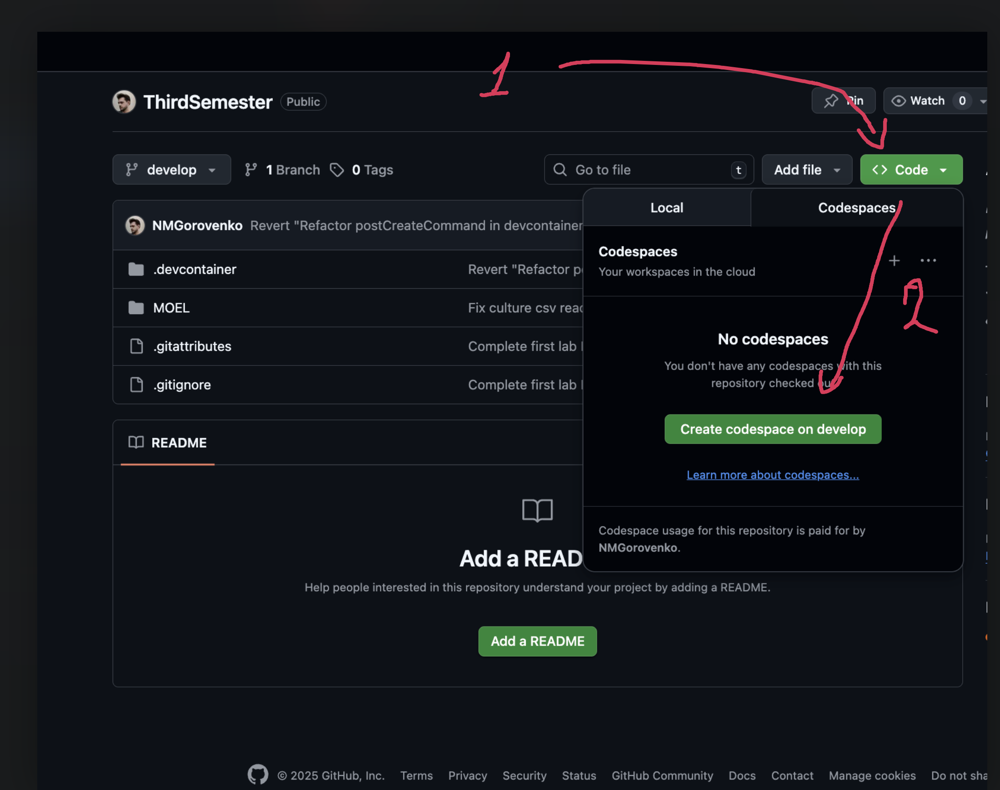
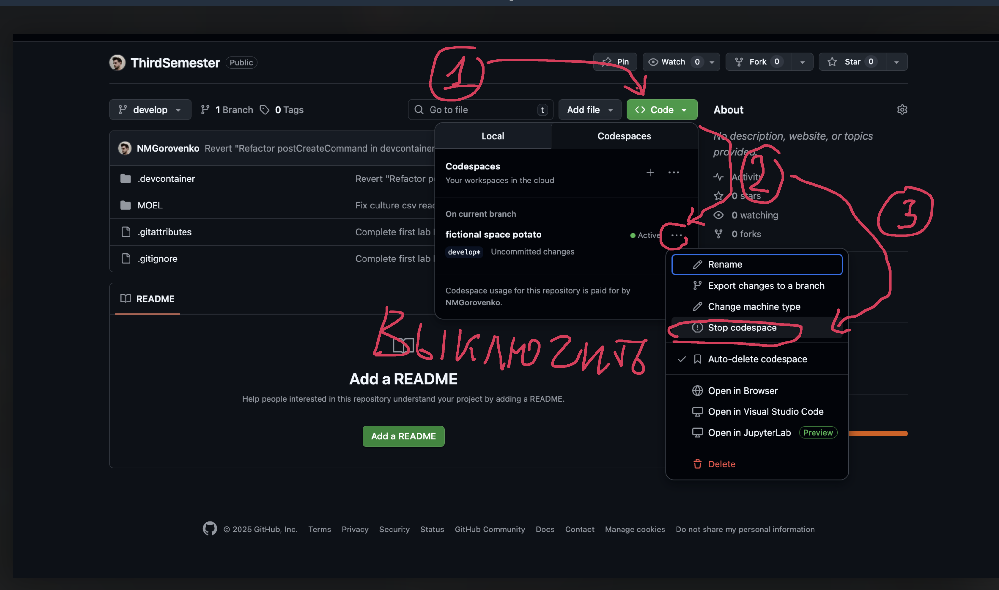

**Лабораторная работа №1 — Токенизация и анализ тональности**

**Задача**
- Реализовать токенизацию и нормализацию (стоп‑слова, простая лемматизация),
- Построить анализатор тональности (наивный Байес),
- Визуализировать частотности.

**Структура**
- `src/lab1.ipynb` — основная .NET (C#) тетрадка.
- `data/` — CSV (Git LFS).

**Запуск (рекомендуется) — GitHub Codespaces**
- Откройте репозиторий на GitHub и нажмите `Code → Codespaces → Create codespace on develop`.
- 
- После подготовки окружения всё уже установлено: .NET SDK, JupyterLab/nbconvert, .NET Interactive, Git LFS. Датасеты подтянутся автоматически (в контейнере выполняется `git lfs pull`).
- После старта контейнера откройте терминал и перейдите в папку работы: `cd MOEL/Lab1`.
- Выполните тетрадку через CLI:
  - `jupyter nbconvert --to notebook --execute src/lab1.ipynb --output out_exec_lab1.ipynb --output-dir src`
  - Итоговый файл: `MOEL/Lab1/src/out_exec_lab1.ipynb`.
- Либо откройте `MOEL/Lab1/src/lab1.ipynb` и нажмите Run All (kernel “.NET (C#)” уже настроен).

**Важно — выключайте Codespace после работы**
- У бесплатных и PRO (Education) тарифов есть лимиты. Чтобы не тратить минуты, отключайте рабочее пространство: `Code → Codespaces → … → Stop codespace`.
- 

Примечание: состав контейнера и автокоманды см. в `MOEL/README.md` (разделы “Состав devcontainer” и “Что автоматически выполняется”).

**Использование и примеры**
- В тетрадке:
  - Чтение `data/train.csv`/`data/test.csv`, фильтрация,
  - Токенизация, удаление стоп‑слов, простая нормализация,
  - Обучение наивного Байеса и печать метрик (Accuracy/F1 и др.),
  - Визуализации распределений.

**Пример работы**
```
original sentence: Shanghai is also really exciting (precisely -- skyscrapers galore). Good tweeps in China:  (SH)  (BJ).
transformed sentence: shanghai also real excit precise skyscraper galore good tweep china sh bj
label: 1
model prediction: positive

original sentence: Recession hit Veronique Branquinho, she has to quit her company, such a shame!
transformed sentence: recession hit veronique branquinho she quit company such shame
label: -1
model prediction: negative

original sentence: happy bday!
transformed sentence: happy bday
label: 1
model prediction: positive

original sentence: http://twitpic.com/4w75p - I like it!!
transformed sentence: http twitpic com like
label: 1
model prediction: positive

original sentence: that`s great!! weee!! visitors!
transformed sentence: great weee visitor
label: 1
model prediction: positive

original sentence: I THINK EVERYONE HATES ME ON HERE   lol
transformed sentence: think everyone hate here lol
label: -1
model prediction: negative

original sentence: soooooo wish i could, but im in school and myspace is completely blocked
transformed sentence: soooooo wish but im school myspace complete block
label: -1
model prediction: negative
```
